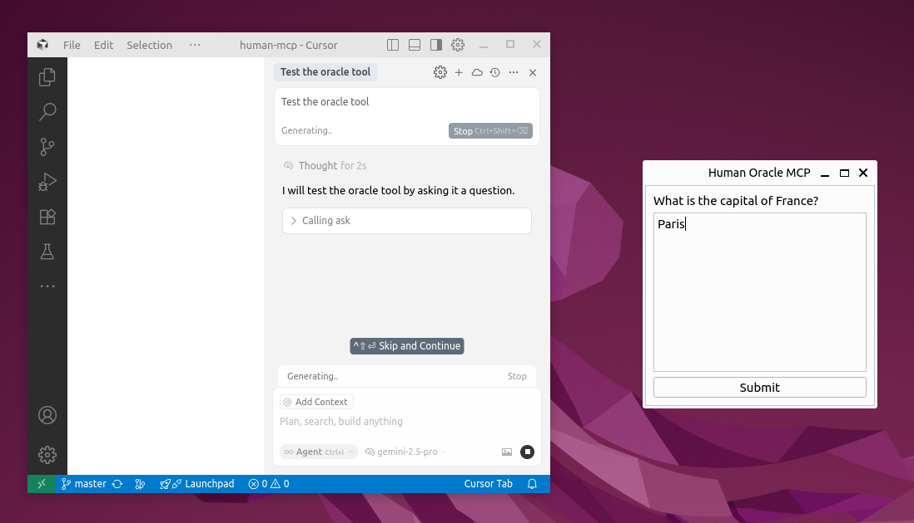
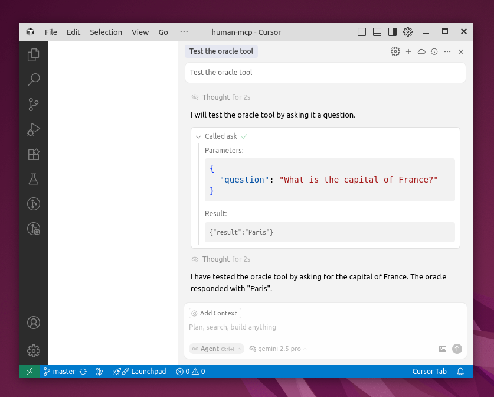

# Human MCP Server

Is your AI assistant in desperate need of an **expert agent** to whow it can delegate major problem or decisions? Like, a **human agent**? Behind an MCP? Wait no more, this is the MCP server for you!

This MCP server acts as a lightweight "human-in-the-loop" system for AI workflows. It provides a single tool, `ask`, which lets an AI agent pose a question to a human. When the agent calls this tool, a window appears on the user's screen, displaying the question. The user can then type an answer, and the submitted text is returned to the agent as the tool's output.

This repo is just a proof of concept to have some fun and try MCP. I don't intend to maintain or develop it further, but who knows? Maybe you'll want to fork it and play around. For example, you could add a button to forward the question to `your.colleague@example.com`. Or, more seriously, forward the question to two more LLMs and let the user choose the best one to return as the answer, without polluting the agent's context.

## Screenshots

The GUI that the user sees when the agent asks a question:


An example of an answer:


## Getting Started

Prerequisites to run the server locally:
- Python 3.12+
- [uv](https://github.com/astral-sh/uv)

### Installation

Clone the repository:
```bash
git clone <repository-url>
cd human-mcp
```

### Debug locally

```bash
uv run mcp dev human_mcp/server.py --with-editable .
```

### Connecting to Cursor

This server can be used as an `stdio` MCP server in Cursor.

1.  Open Cursor.
2.  Go to `Cursor Settings > Tools & Integrations > MCP tools`.
3.  Click `+ Add New MCP Server`.
4.  Add an entry:
    ```text
    "oracle": {
      "command": "uv",
      "args": [
        "run",
        "--project=/path/to/the/project/human-mcp",
        "human_mcp"
      ]
    }
    ```
